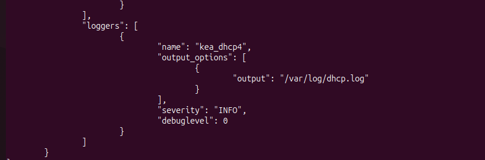

## Servidores DHCP Linux.

### 1 - Configuración (grep -v "^#" /etc/kea/kea-dhcp4.conf)

### 2 - log de ned visualizando a asignación de enderezos en cada un dos pool e da reserva estática

### 3 - Configuración de servidores DNS, router e enderezo IP de cada cliente

**Fichero db.stark.lan**

**named.conf.local**

**zona inversa**

**router**

### 4 - log de ned e robb (simultáneos) facendo unha actualización mediante chaves en arya.
### 5 - log de ned visualizando asignacións da segunda subrede (lannister) e actualizacións no servidor dns correspondente.
### 6 - Log dos dous servidores failover cando dous clientes obteñen enderezos
### ...

